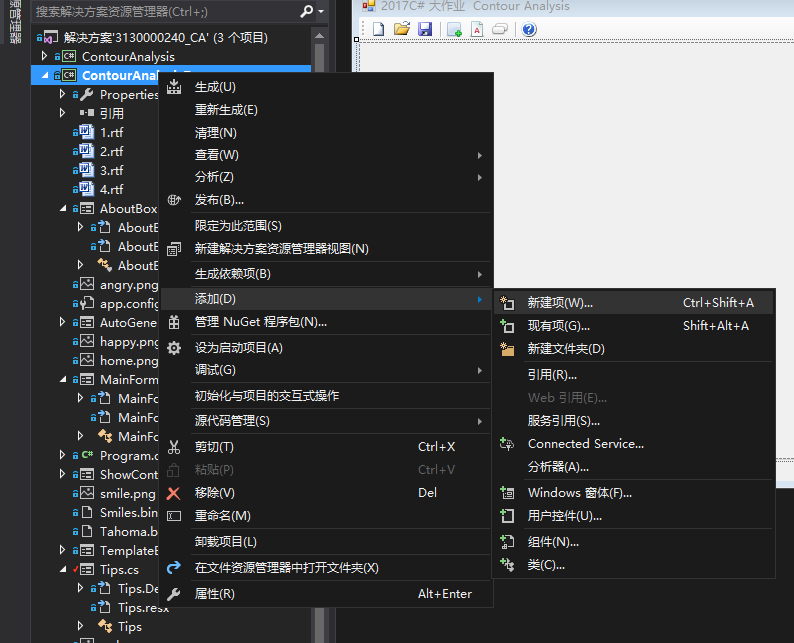

# Contour Analysis 轮廓分析
## 2017暑假短学期C＃作业   实验报告

陈泓宇 3130000240 2017年9月11日

#### 一、关于CA的一些资料(翻译自所给材料)
> ##### 什么是轮廓分析所必需的
> CA允许描述，存储，比较和查找以外部轮廓 - 轮廓形式呈现的对象。
>
> CA允许有效地解决模式识别的主要问题 - 转置，转动和对象图像的重新定标。 CA方法对这些转换是不变的。
> ##### 主要概念
>
我们定义了这样一个对象轮廓。轮廓是物体的边界，一个点（像素），将物体与背景分离。
在CA中，轮廓由由复数组成的序列编码。在轮廓上，被称为起点的点是固定的。然后，扫描轮廓（允许 - 顺时针），并且每个偏移矢量由复数a + ib表示。其中x轴上的点偏移，y轴上的b偏移。关于前一点的偏移。

#### 二、介绍原始项目（翻译自所给材料）
> ##### 一般识别算法
>
> 1. 初步处理图像 - 平滑，过滤噪音，对比度提高
> 2. 图像的二值化和物体轮廓的选择
> 3. 轮廓周边，正方形，波峰因子，分形等的初始过滤
> 4. 轮廓的强制长度均匀，平滑
> 5. 搜索所有发现的轮廓，搜索与给定轮廓类似的模板最大值
>
> ##### CA 库
>库包括两个项目。第一个项目<b> ContourAnalysis </b> - 实现轮廓分析的基本功能 - 创建轮廓，轮廓，均衡，评估ICF和ACF的标量积，比较和搜索模板。
>
>+ 类<b>Contour</b> - 创建和存储轮廓。它包含轮廓的基本操作 - 标量积，缩放，均衡，归一化，频谱评估，评估ACF和ICF。
>+ 类<b>Template</b>用于创建模板的基础。该类存储轮廓，其ACF，描述符ACF，初始轮廓（面积）的线性参数，轮廓的范数。此外，模板具有用作识别值的名称。
>+ 类<b>TemplateFinder </b>可以快速搜索给定轮廓的模板。该类的操作结果是<b>FoundTemplateDesc</b>，其中包含初始轮廓，并为给定轮廓找到模板。
>+ 另外，相对于模板，<b> FoundTemplateDesc</b>包含相似度，旋转角度和轮廓的比例。
>
>第二个项目 - <b> ContourAnalysisProcessing </b> - 包含初步处理图像，轮廓选择，过滤和识别的方法。此外，它还包含用于自动生成用于识别打印符号的模板的工具。
>
>项目<b> ContourAnalysisProcessing </b>使用库OpenCV（EmguCV .NET包装器）对图像进行操作。
>+ 类<b> ImageProcessor </b>用于图像处理。它也存储模板的基础。
>+ - 方法<b> ImageProcessor.ProcessImage（）</b>在输入端接收图像。操作的结果是发现的轮廓列表（<b> ImageProcessor.samples </b>）和识别的轮廓列表（<b> ImageProcessor.foundTemplates </b>）。
>+ 类<b> ImageProcessor </b>还包含搜索轮廓的设置。
> <b> ImageProcessor </b>的工作原理如下：
> 1. 首先，图像将被转换成灰度级
> 2. 然后由<b> AdaptiveThreshold </b>进行二值化
> 3. 提取轮廓
> 4. 轮廓线性参数（长度，平方等）
> 5. 轮廓均衡，有计算ACF和ACF描述符
> 6. 然后是最合适的模板
>
>+ 静态类<b> TemplateGenerator </b>用于自动生成某个字体的数字模板。
>
>除了两个库项目，还有一个演示示例，展示了使用网络摄像头的图书馆的操作。该演示包含用于创建和编辑模板，识别调整的工具，并允许从网络摄像头生成轮廓的识别，并且还允许创建增强现实。

### 三、我所做的工作
#### 将演示示例翻译成中文
##### 步骤
1. 通读材料，理解并熟悉Contour Analysis相关概念
2. 打开工程、了解程序大致分为几个模块，找到入口
3. 编译并运行工程，熟悉程序的功能
4. 遍历所有的功能，并将所有需要翻译的地方（label、button等）依照理解翻译成中文（设置Text属性）

##### 心得
这个任务看似十分简单，但是通过这个工作，我熟悉了CA的各种概念（会体现在后面的工作中），以及整个工程，了解了它的每个功能以及如何实现它们。

#### 编写窗口“小贴士”来简单介绍CA和告诉用户如何使用示例程序
##### 步骤
1. 

#### 编写“关于”窗口 介绍程序信息。

### 四、
